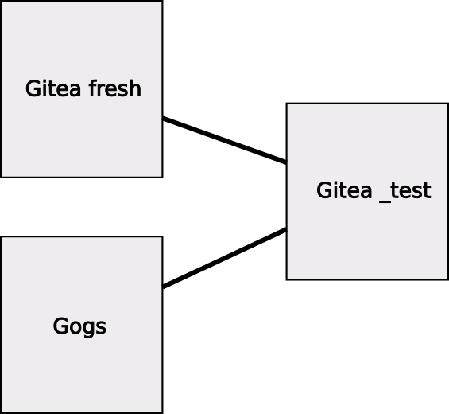

# Gogs2Gitea  

<h1>

 Gogs to Gitea Migration</h1>

# SQL for moving from Gogs to Gitea

<br />

- Gogs Application version  0.12.3 (Database version 1.19)
- Gitea Application version 1.12.5 (Database version 1.141)
  
<br />  
  
Note: This should also work with Gitea version 1.12.6.  
After upgrade no changes to the database structure were detected, and the database structure version remained the same at 1.141.  
   
<br />  
   
## Purpose

The purpose of the script is to migrate from Gogs to Gitea in one step.  
Rather than to Gitea 1.0 -> 1.1 -> 1.2 etc.

It may form the basis for migrating from other versions of Gogs to this / future versions of Gitea.


|     |Gogs 0.11.8  |Gogs 0.11.9  |Gogs 0.12.3  |
|-------------|-------------|-------------|-------------|
|**Gitea 1.12.5** |      x      |      x      |    ***This***     |
|**Future**       |      x      |      x      |     x       |
|**Future**       |      x      |      x      |     x       |
|**Future**       |      x      |      x      |    etc      |

<br />

The process takes information from a freshly installed Gitea database and merges it with contents from the Gogs database.

Keeping the freshly installed Gitea database untouched means the process can be retried if things don't work first time.

<html>
 
</html>


## Assumptions and Caveats
This script was used on a MariaDB Server v10, all databases were located on this single server.  
It is assumed that your system has similar capabilities.  
 
The Gogs installation may not be a "clean" install of 0.12.3, it may have been upgraded from an earlier version.  
The Gogs installation was very new and small.  
For this reason not many features of Gogs were in use at the time.  
The data was originally exported from Gogs, hence lines in the script that say - 

`-- Dumping data for table gogs.tablename : ~0 rows (approximately)`

Lines with 0 (zero) rows can be assumed to be untested tables / features.

It may be possible to "Lock" user accounts and repositories in Gitea pending review through the web UI. But I have not done this.  

Some defaults are inserted by the script.  
The repo_unit table in particular has the following 5 rows (1 for each type) inserted for each repository.  

|Type     |Config   |
|---------|---------|
|1        |  NULL   |
|2        |  {"EnableTimetracker":true,"AllowOnlyContributorsToTrackTime":true,"EnableDependencies":true}       |
|3        |  {"IgnoreWhitespaceConflicts":false,"AllowMerge":true,"AllowRebase":true,"AllowRebaseMerge":true,"AllowSquash":true}       |
|4        |  NULL       |
|5        |  NULL       |  

<br />

I beleive the types relate to the tabs across a repositories page. 

Code, Issues, Pull Requests, Release, Wiki.  

If a type 1 row does not exist for example, the Code tab will not be present.  

Type 2 is the Issues tab  
Type 3 is for the Pull Request tab etc.  

<br />
Where tables / information is not present in Gogs, the table be be copied from the Gitea fresh db, or defaults are inserted to avoid wierd values appearing, such as negitive numbers for timestamps etc.  

<br />
<br />

I have zero experience of Go, and was using the Gogs, Gitea with embedded Go.  
SQL is not a procedural language, so complex things are harder to acheive, but sticking with it means that installations of Go, NodeJS etc. are not required.

<br />  
<br />  


## Instuctions
1. Backup everything.
2. Optionally copy the Gogs git repositories to a new location.
3. Make sure that the new Gitea installation will have correct permisions to db's / file locations etc.
4. Install Gitea 1.12.5 following the instructions given by Gitea website.
5. During installation create an Admin user (id=1).
6. Sign in to the new installation and check everything is how you want it (do not create repositories).
7. Stop Gitea.
8. Copy the database structure (no data) using any suitable SQL tool (HeidiSQL etc) to a new database.  
    *You may have to save the structure as a 'backup / creation' script, change the database name and run it.*
9. Edit the 'SET' statements at the top of the Gogs2Gitea script to point to the databases.
   
    @giteadb, @sourcedb, @targetdb and @user1

    ```sql
    SET @giteadb = 'gitea';  -- The freshly installed Gitea database.
    SET @sourcedb = 'gogs'; -- The gogs database
    SET @targetdb = 'gitea_test'; -- The new Gitea database, may want to rename database after testing.
    SET @user1 = 'gitea'; -- Get user with id 1 from this schema.
    ```


        > [!IMPORTANT]  
        > The admin user will be pulled in from the db specified in @user1.  
        > Anything owned by user 1 in gogs will now be owned by this user.  
        > Any repos will need to be moved if the user 1 name changes.  
        > e.g. gogsadmin -> giteaadmin  

10. Run the Gogs2Gitea script.  
11. Edit Giteas' *app.ini* to point to the test db.  
    ```ini
    NAME     = gitea
    ```  
    to  
    ```ini
    NAME     = gitea_test
    ```  
    for example  

12. Optionaly change the repository root if you copied the git repos to a new locations.  

    ```ini
    [repository]
    ROOT = /gogs/repos/git
    ```  
    to  
    ```ini
    [repository]
    ROOT = /gitea/repos/git
    ```  
    for example
13. Start Gitea
14. Go to the Gitea web page and sign-in as the admin user.
15. You should see the home page with repositories listed etc.
16. Go into "Site Administration"
17. Review each "User" entry using the GUI.
18. Review each "Organizastion" using the GUI.
19. For each repository   
    Review the repositories "Settings" using the GUI.
20. In "Site Administration" -> "Dashboard", run  
    Resynchronize pre-receive, update and post-receive hooks of all repositories.
21. As a non admin user, check operations such as Commit, Push/Pull etc
22. As a non admin user create a test issue.
23. If everything seems OK.
24. Stop Gitea
25. Rename the "gitea_test" database to the name you want. Alter app.ini to suite.
26. Point app.ini to the production git repository root (if changed).
27. Start Gitea.

<br />  


## Issues & Observations  

### SSH / GPG Keys etc.
No ssh or gpg keys were present in the Gogs system being migrated. So this feature is untested.  

### Application Tokens

Application tokens were imported and worked in some applications, but seemed not to in others.  
They seemed to work in the swagger api page, yet some applications seemed to fail.  
Newly created application tokens worked OK.  
It is recommended to recreate all application tokens and reconfigure the relevent applications.

### Dashboard  
When on the Dashboard, using the "Switch Dashboard Context" and switching to an organisation, the page then shows each action twice.  
These are new actions created in Gitea not those migrated from Gogs.  
This problem is confirmed by looking at the "actions" table. 

|id |user_id|op_type|act_user_id|repo_id|comment_id|is_deleted|ref_name|is_private|content|created_unix|  
|-|-|-|-|-|-|-|-|-|-|-|
|844|3|6|3|12|0|0||1|"30\|USB3 powered hub stops Pi 4 booting"|1605593906|
|845|2|6|3|12|0|0||1|"30\|USB3 powered hub stops Pi 4 booting"|1605593907|
|846|1|6|3|12|0|0||1|"30\|USB3 powered hub stops Pi 4 booting"|1605593907|
|847|2|6|3|12|0|0||1|"30\|USB3 powered hub stops Pi 4 booting"|1605593907|  

<br />  

In the above example the issue is recorded in 4 rows. Each row is exactly the same except for the 'user_id' column (and 'id' column of course).  
Notice the the user with id = 2 is repeated. User 2 is in fact the only organisation defined in the database.   
I don't know if this problem is related to the migration or if it exists in a clean Gitea setup.  
I don't know what is causing the duplicate entry.  
The primary key is the 'id' column. A unique key across other columns could prevent this.  

### Wiki Pages  

Not related to the database, but of interest to the migration.  
When selecting pages from the drop down, you are redirected to the "Pages" page, listing the pages.  
Clicking on the required page just comes back to the "Pages" page.  
This was fixed by cloning the wiki repository and removing spaces from file names and pushing the changes back up.  
It maybe that Gogs and Gitea handle spaces differently.
